# lab6web
Nama : Raihan Syahwal

NIM : 312110362

Kelas :TI.21.B.1

## latihan lab6web
pertama buatlah file html dan dengan memasukan dengan bootstrap

seperti gambar di bawah
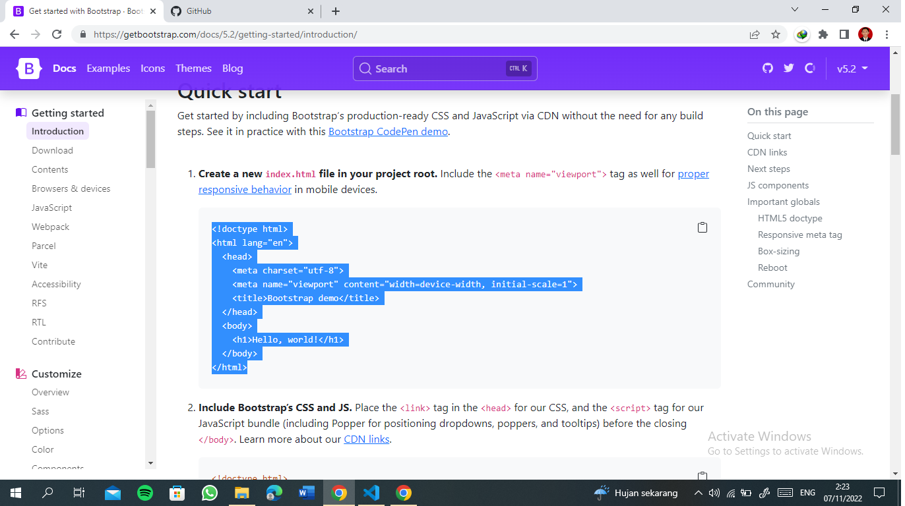
### link
{merah}tambahkan link bootstrap untuk memasukan icon yang sesuai keinginan

{kuning}karna jika link bootstrap saya error maka saya {biru}menggunakan font awesome sebagai gantinya 

dan tambahkan juga file css untuk merapihkan desain

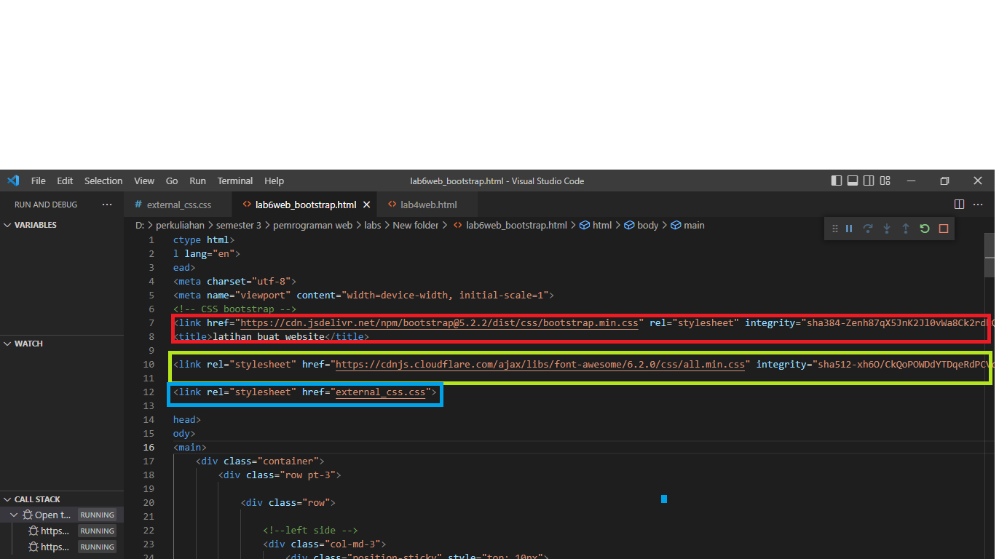
#### left side
tambahkan class container untuk merapihkan sebuah colom yang akan di buat dan di sini  saya akan membuat 3 kolom yang berbeda

yaitu ada left side yang di beri lebar colom 3
main 6 , dan right 3

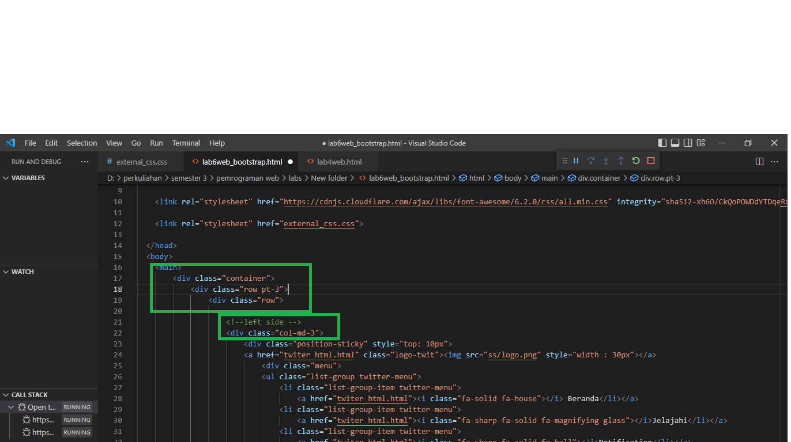
dan
<h1>!file sebelum change name</h1>

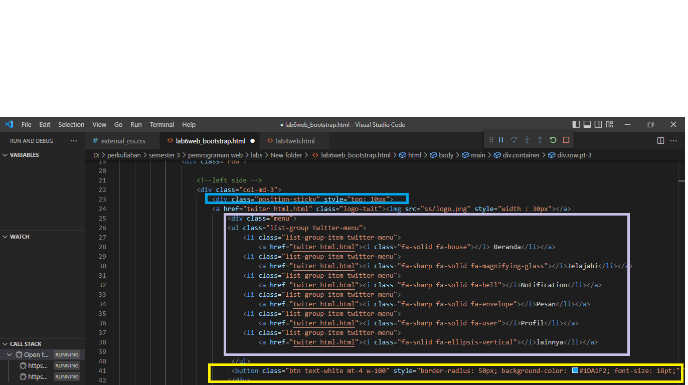
pada biru untuk mengunci pada saat scroll di website agar tidak ikut turun oleh yang bisa di scroll

pink menambah class grup dan memasukan icon dari sebuah web font awesome seperti i class fa untuk font awesome dan fa bell untuk icon pada font awesome

kuning untuk twit button
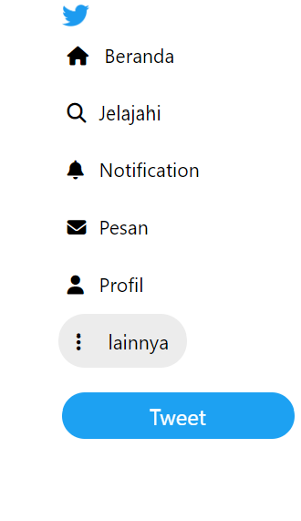
da tambahkan file css untuk menambahkan bayangan dengan hover
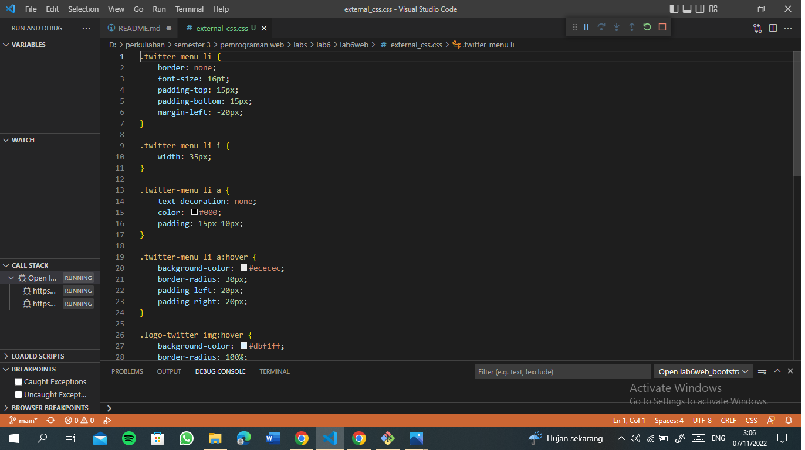
##### main center
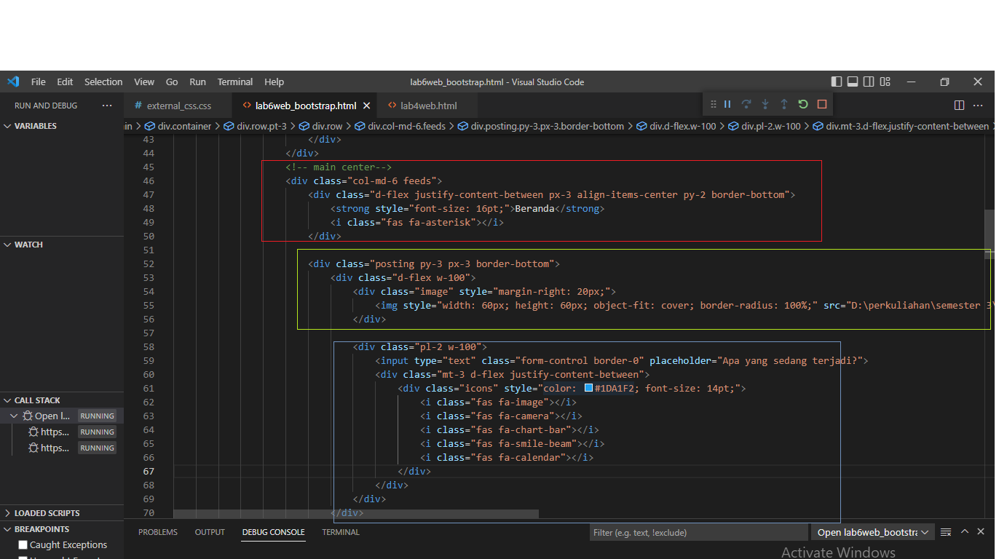
merah menambahkan border dana teks beranda pada bagian atas

kuning menambahkan gambar untuk profile

dan biru menambahkan input type dan di sertakan dengan icon dari font awesome

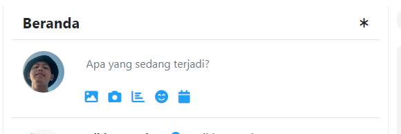
###### main 
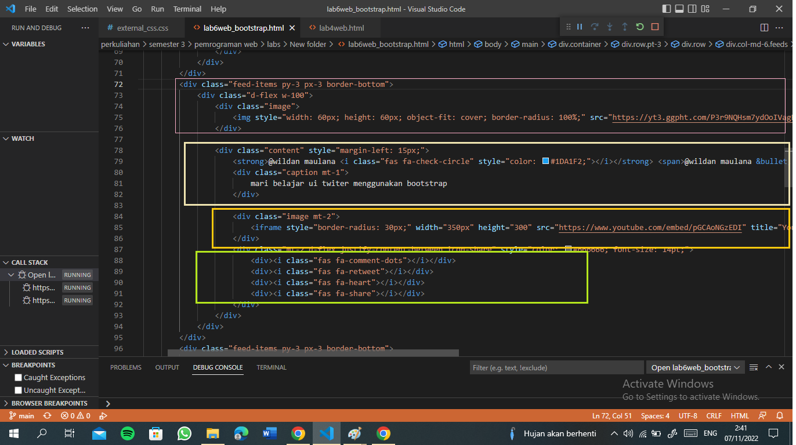
pink menambahkan div class untuk menambahkan border dan menambahkan logo untuk profile tampilan beranda

cream untuk nama pengguna dan deskripsi 

kuning menambahkan link yt untuk di tampilkan di halaman

hijau menambahkan icon dengan font awesome
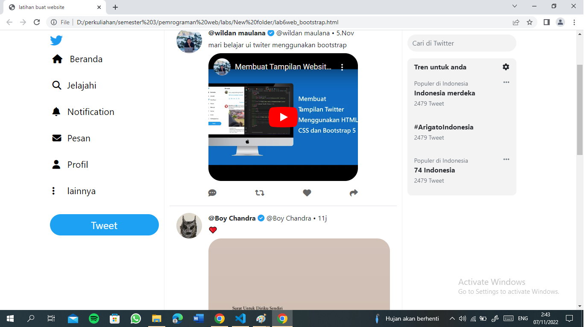
###### right bar
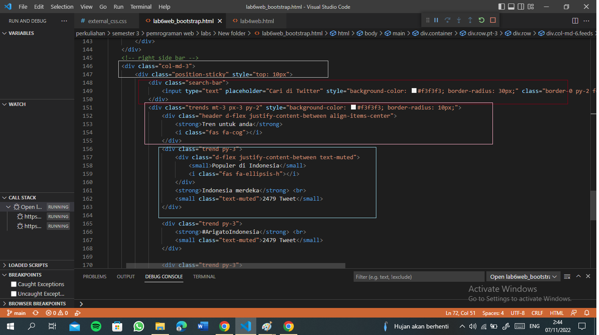
cream untuk pengunci saat scroll

merah menambahkan class search bar

pink membuat tampilan pada samping dengan menambah justify untuk merata tengah kan tenks dengan icon

biru menambahkan class trend dan membuat tampilan trend seperti di twiter
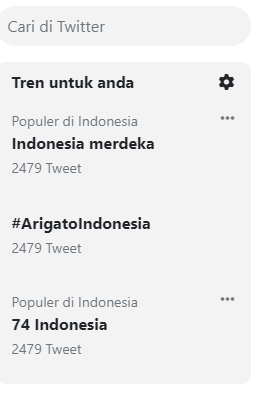
###### hasil lengkap tamplan
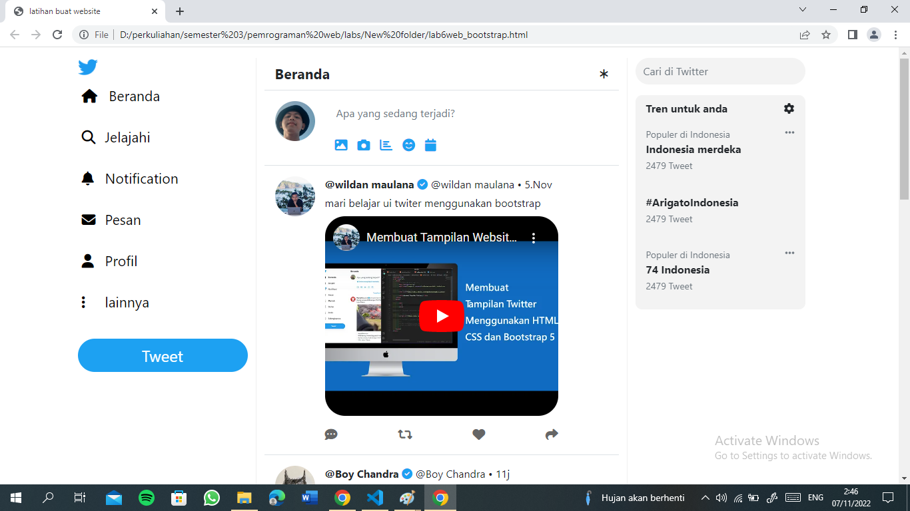
